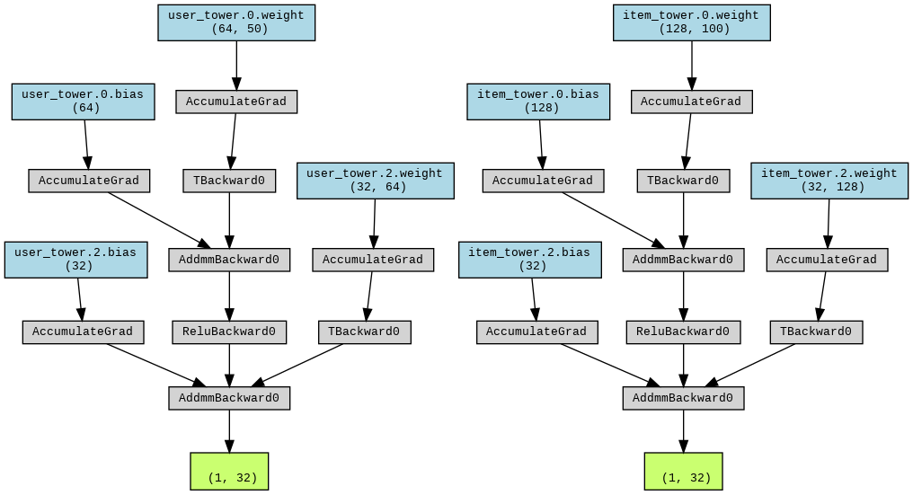

# Basic 2 Tower Network for Recommendation System

A basic 2 tower network for recommendation system using pytorch.

## Introduction

This is a basic 2 tower network for recommendation system. We create a random user and item feature matrix then a random user-item interaction matrix. We use the interaction matrix to train the network. The network is trained to embed the user and item features in a latent space where the dot product of the user and item features is the interaction matrix.

## Usage

```shell
python main.py
```

## Network Architecture

(Maybe I can do a better demonstration of the network architecture...)


